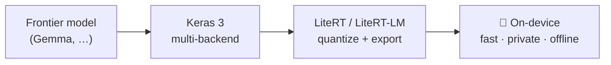

# Hi, I'm Rahul 👋

**ML Engineer at Google, working on Keras** — I enjoy making machines a little
smarter every day, and making the smart ones run fast on small devices.
Previously at Qualcomm and Samsung R&D, building **face recognition, computer
vision, and sensor-driven systems** for millions of devices. Based in India 🇮🇳.

🌐 **[pctablet505.github.io](https://pctablet505.github.io)** · 💼 [LinkedIn](https://linkedin.com/in/rahul126) · 📈 1,000+ contributions in the last year

---

## ⚡ Open-source impact

**60 merged PRs** across Google's Keras ecosystem —
[keras](https://github.com/keras-team/keras/pulls?q=is%3Apr+author%3Apctablet505+is%3Amerged) (40) ·
[keras-hub](https://github.com/keras-team/keras-hub/pulls?q=is%3Apr+author%3Apctablet505+is%3Amerged) (15) ·
[keras-io](https://github.com/keras-team/keras-io/pulls?q=is%3Apr+author%3Apctablet505+is%3Amerged) (3) ·
[litert-torch](https://github.com/google-ai-edge/litert-torch/pulls?q=is%3Apr+author%3Apctablet505+is%3Amerged) (2)

Some I'm proud of:

- [keras#22758](https://github.com/keras-team/keras/pull/22758) — **LiteRT export for the PyTorch backend**: on-device deployment of PyTorch-trained Keras 3 models
- [keras#22822](https://github.com/keras-team/keras/pull/22822) — **security fix in `deserialize_keras_object`**: closed a namespace-hijacking / callable-injection hole in model loading
- [keras#23186](https://github.com/keras-team/keras/pull/23186) — **faster attention on torch**: SDPA `is_causal` dispatch + bounded causal-mask cache in `MultiHeadAttention`
- [keras#23189](https://github.com/keras-team/keras/pull/23189) — **hot-path speedups** in `convert_to_tensor` / `cast` on the torch backend

---

## 🛠 What I work on

Edge & on-device AI · model optimization (quantization, latency, memory) ·
multi-backend Keras internals · computer vision & applied ML that actually ships.

> 🕶 **The part you can't see here:** my major work before Google was
> **face recognition and face-related solutions** — plus computer-vision and
> camera/sensor problems — at Samsung R&D and Qualcomm. Real-time face auth
> serving 10,000+ registered faces on-device, embedding search cut from
> 1,200 ms → 87 ms, sensor-based drop detection at 95% less power. All
> closed-source, so GitHub only shows my Keras side.

---

## 🚀 Featured work

| Project | What it is |
|---|---|
| [ats-optimizer](https://github.com/pctablet505/ats-optimizer) | Truthful, human-in-the-loop job-application automation — feed-based discovery, knowledge vault, tailored resumes, ATS analysis |
| [litert-demo](https://github.com/pctablet505/litert-demo) | End-to-end export of KerasHub Gemma3 → LiteRT `.tflite` / LiteRT-LM `.litertlm` |
| [gemma-tflite-android-demo](https://github.com/pctablet505/gemma-tflite-android-demo) | Gemma running fully on-device on Android |
| [jax-windows-cuda-build](https://github.com/pctablet505/jax-windows-cuda-build) | CUDA build scripts, patches & pre-built JAX wheels for Windows |
| [daily_tracker](https://github.com/pctablet505/daily_tracker) | Cross-platform daily task tracker with Google Drive sync & auto-updates |
| [ML-Guide](https://github.com/pctablet505/ML-Guide) | Curated AI/ML learning path — courses, books, study notes |

---

## 📊 GitHub at a glance

<!-- Static self-generated cards (see gen_cards.py) — the shared
     github-readme-stats instance rate-limits and breaks randomly. -->

---

## 📚 Currently exploring

- Better performance from smaller models — quantization, distillation, smarter kernels
- Synthetic data generation techniques
- Building a gallery search system
